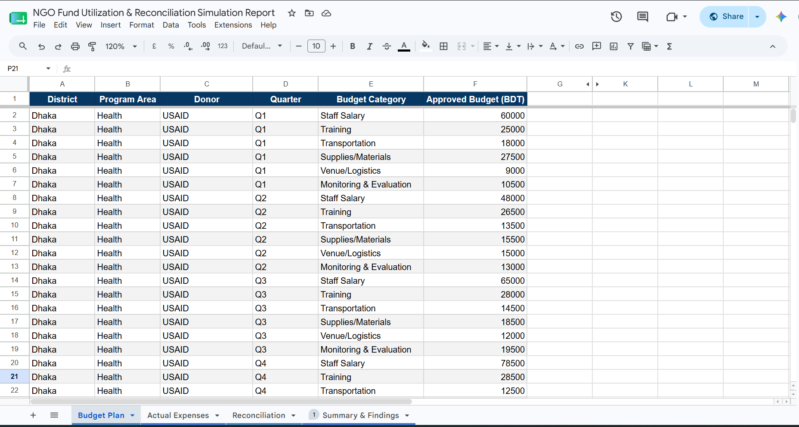
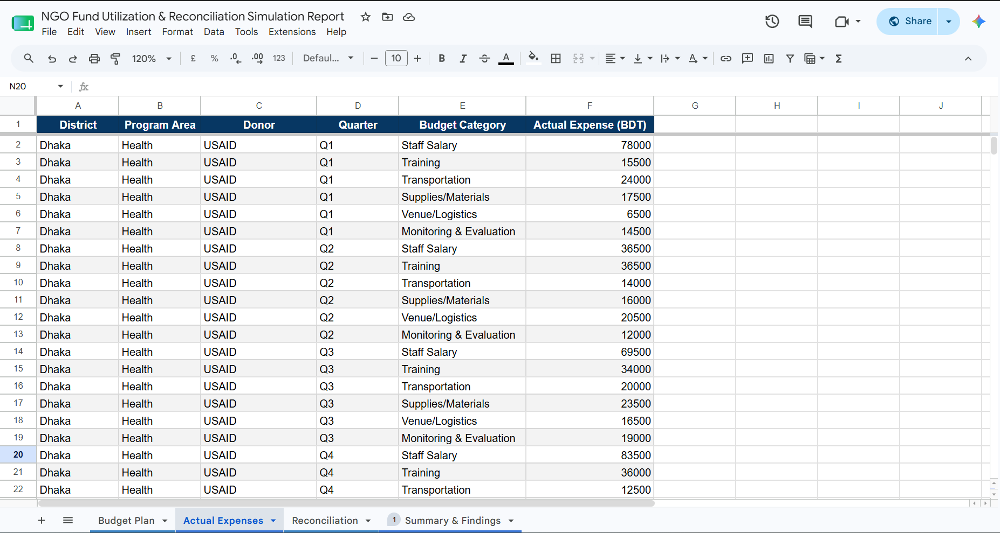
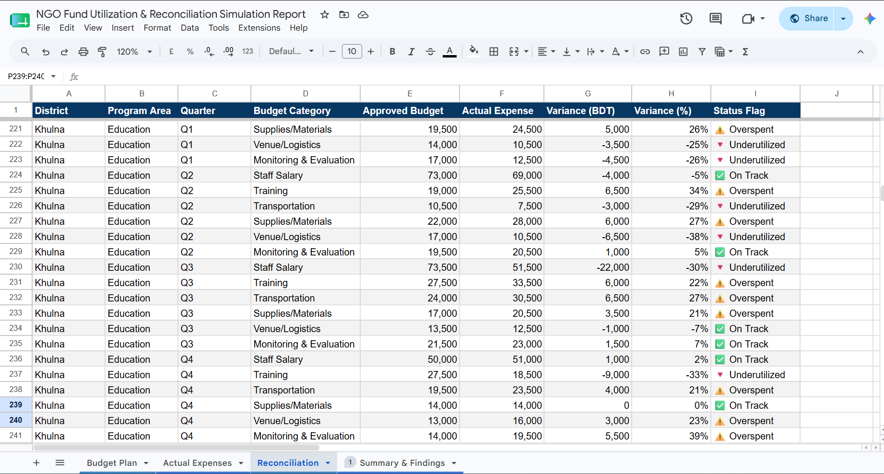
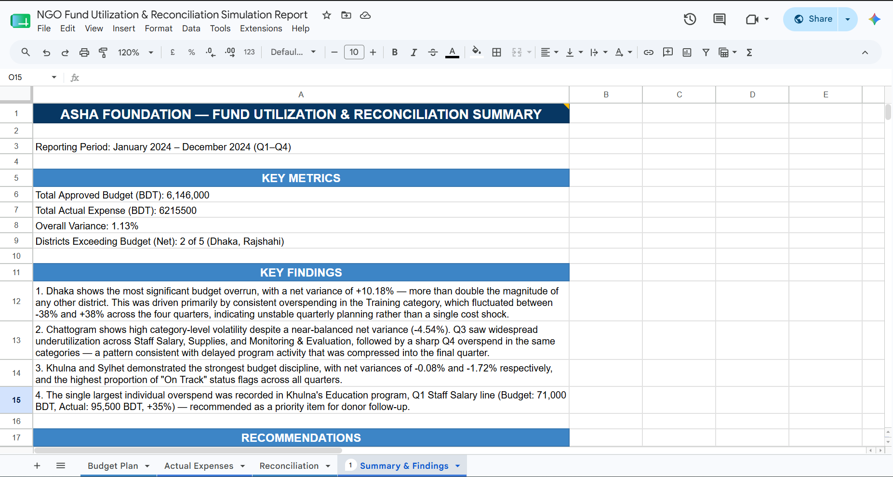

# 🏥 NGO Fund Utilization & Reconciliation Simulation Report — Google Sheets

A financial reconciliation project simulating how an NGO tracks, compares, and analyzes budget utilization across multiple districts, program areas, and donors. Built entirely in Google Sheets using a four-tab workbook structure for a fictional organization, **Asha Foundation**.  

---

## 📌 Project Overview

NGOs operating across multiple districts often struggle to reconcile approved budgets against actual field spending in a timely, structured way. This project simulates that exact challenge — tracking quarterly budget allocation versus actual expenditure across 5 districts in Bangladesh, then surfacing variance, status flags, and actionable findings for program managers and donors.

The project was built to demonstrate real-world financial analysis skills using only spreadsheet formulas — no external tools required.

---

## 🔗 Live Project

📊 **[View the full Google Sheets workbook](https://docs.google.com/spreadsheets/d/1y57YtoCo8q_G3HmJFmPfRmpRgWyKz3alAmJYRG7G9Ks/edit?usp=sharing)**

---

## 📑 Workbook Structure

This project is organized into **4 connected tabs**, each serving a distinct purpose in the reconciliation workflow:

### Tab 1 — Budget Plan

Contains the approved quarterly budget across all districts, program areas, donors, and budget categories.

- **Columns:** District, Program Area, Donor, Quarter, Budget Category, Approved Budget (BDT)   
- Covers 5 districts, multiple program areas, and 6 budget categories (Staff Salary, Training, Transportation, Supplies/Materials, Venue/Logistics, Monitoring & Evaluation) across all four quarters   

---

### Tab 2 — Actual Expenses

Mirrors the structure of the Budget Plan tab but records the actual amount spent in the field for each corresponding line item.   

- **Columns:** District, Program Area, Donor, Quarter, Budget Category, Actual Expense (BDT)   
- Allows for direct row-by-row comparison against approved budget figures   

---

### Tab 3 — Reconciliation

The analytical core of the project — compares Approved Budget against Actual Expense for every line item and calculates variance.   

- **Columns:** District, Program Area, Quarter, Budget Category, Approved Budget, Actual Expense, Variance (BDT), Variance (%), Status Flag   
- **Status Flag Logic:**   
  - ✅ **On Track** — minimal variance   
  - ⚠️ **Overspent** — actual exceeds approved budget significantly   
  - 🔻 **Underutilized** — actual falls significantly below approved budget   

---

### Tab 4 — Summary & Findings

A written executive summary translating the raw reconciliation data into key metrics, findings, and recommendations — written in the voice of a financial analyst reporting to NGO leadership.   

---

## 📊 Key Metrics (Full Year 2024)

| Metric | Value |
|--------|-------|
| Reporting Period | January 2024 – December 2024 (Q1–Q4) |
| Total Approved Budget | 6,146,000 BDT |
| Total Actual Expense | 6,215,500 BDT |
| Overall Variance | 1.13% |
| Districts Exceeding Budget (Net) | 2 of 5 (Dhaka, Rajshahi) |

---

## 🔍 Key Findings

**1. Dhaka Shows the Most Significant Budget Overrun**   
Dhaka recorded a net variance of **+10.18%** — more than double the magnitude of any other district. This was driven primarily by inconsistent overspending in the Training category, which swung between -38% and +38% across the four quarters, pointing to unstable quarterly planning rather than a single cost shock.

**2. Chattogram Shows High Volatility Despite a Balanced Net Variance**   
Despite a near-balanced net variance of -4.54%, Chattogram saw widespread underutilization in Q3 across Staff Salary, Supplies, and Monitoring & Evaluation — followed by a sharp Q4 overspend in the same categories. This pattern suggests delayed program activity that was compressed into the final quarter.   

**3. Khulna and Sylhet Demonstrated the Strongest Budget Discipline**   
With net variances of -0.08% and -1.72% respectively, these two districts recorded the highest proportion of "On Track" status flags across all four quarters — making them strong internal benchmarks.   

**4. The Single Largest Overspend Was Identified in Khulna**   
A Q1 Staff Salary line item in Khulna's Education program recorded a +35% overspend (Budget: 71,000 BDT, Actual: 95,500 BDT) — flagged as a priority item for donor follow-up.   

---

## 💡 Recommendations

1. Conduct a targeted review of Dhaka's Training budget-setting process — the swing from -38% to +38% within one year suggests the root issue is planning accuracy, not uncontrolled spending.   
2. Investigate Chattogram's Q3 program delays to confirm whether the Q4 spending surge reflects legitimate catch-up activity or scope creep.   
3. Use Khulna and Sylhet's quarterly planning approach as an internal best-practice benchmark for other districts.   

---

## 🛠️ Tools & Skills Used

- Google Sheets   
- Multi-tab Workbook Design   
- Budget vs. Actual Variance Analysis   
- Conditional Status Flagging (On Track / Overspent / Underutilized)   
- Data Organization Across Districts, Donors, and Program Areas   
- Financial Reporting & Written Analysis   
- Professional Spreadsheet Formatting   

---

## 💡 Key Learnings

- How to structure a multi-tab workbook so each sheet builds logically on the one before it   
- Designing a variance analysis system that flags issues automatically rather than requiring manual review   
- Translating raw numbers into a written summary that speaks to decision-makers, not just analysts   
- Thinking through realistic NGO financial reporting scenarios across multiple districts and donors   
- Identifying patterns (like Dhaka's planning instability or Chattogram's delayed activity) rather than just stating surface-level numbers   

---

## 📄 Project Report

A full written summary report is included in this repository as `ngo-fund-reconciliation-report.pdf`, covering key metrics, findings, and recommendations in a donor-ready format.

---

## 👤 Author

**Md. Sirajul Islam**   
📎 [linkedin.com/in/md-sirajul-islam57](https://linkedin.com/in/md-sirajul-islam57)   
🐙 [github.com/sirajul-islam5](https://github.com/sirajul-islam5)   

---

## 📄 License

This project is open source and available under the [MIT License](LICENSE).   

---

> *This is a self-driven simulation project created for learning and
> portfolio purposes. Asha Foundation, all districts, donors, and
> financial figures are fictional and built for demonstration only.*
